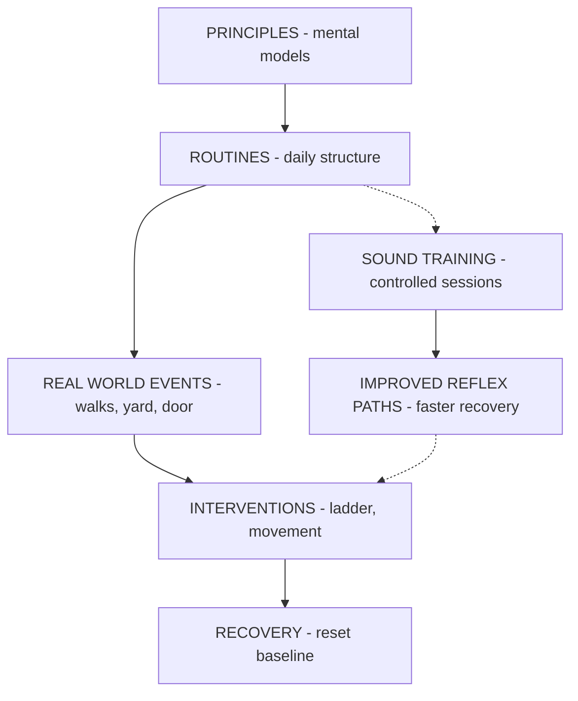

```mermaid
flowchart TD
  %% Core execution spine
  P[PRINCIPLES - mental models]
  R[ROUTINES - daily structure]
  RW[REAL WORLD EVENTS - walks, yard, door]
  INT[INTERVENTIONS - ladder, movement]
  REC[RECOVERY - reset baseline]

  P --> R
  R --> RW
  RW --> INT
  INT --> REC

  %% Offline shaping (non-execution path)
  ST[SOUND TRAINING - controlled sessions]
  IR[IMPROVED REFLEX PATHS - faster recovery]

  R -.-> ST
  ST --> IR

  %% Modifier relationship (not a flow step)
  IR -.-> INT
```
