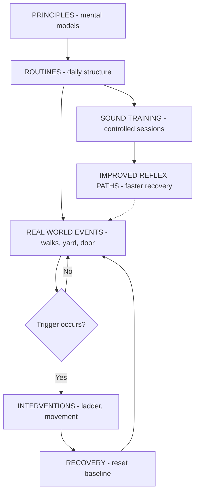

```mermaid
flowchart TD
  P[PRINCIPLES - mental models]
  R[ROUTINES - daily structure]

  ST[SOUND TRAINING - controlled sessions]
  IR[IMPROVED REFLEX PATHS - faster recovery]

  RW[REAL WORLD EVENTS - walks, yard, door]
  T{Trigger occurs?}

  INT[INTERVENTIONS - ladder, movement]
  REC[RECOVERY - reset baseline]

  P --> R

  %% Routines include both sound training and real-world activities
  R --> ST
  R --> RW

  %% Offline training improves reflexes
  ST --> IR

  %% Improved reflexes modify real-world events (fewer/less intense triggers)
  IR -.-> RW

  %% Real-world events conditionally require interventions
  RW --> T
  T -- Yes --> INT
  T -- No --> RW

  %% If intervention happens, recovery follows
  INT --> REC

  %% Recovery returns to real life / routines
  REC --> RW

```
