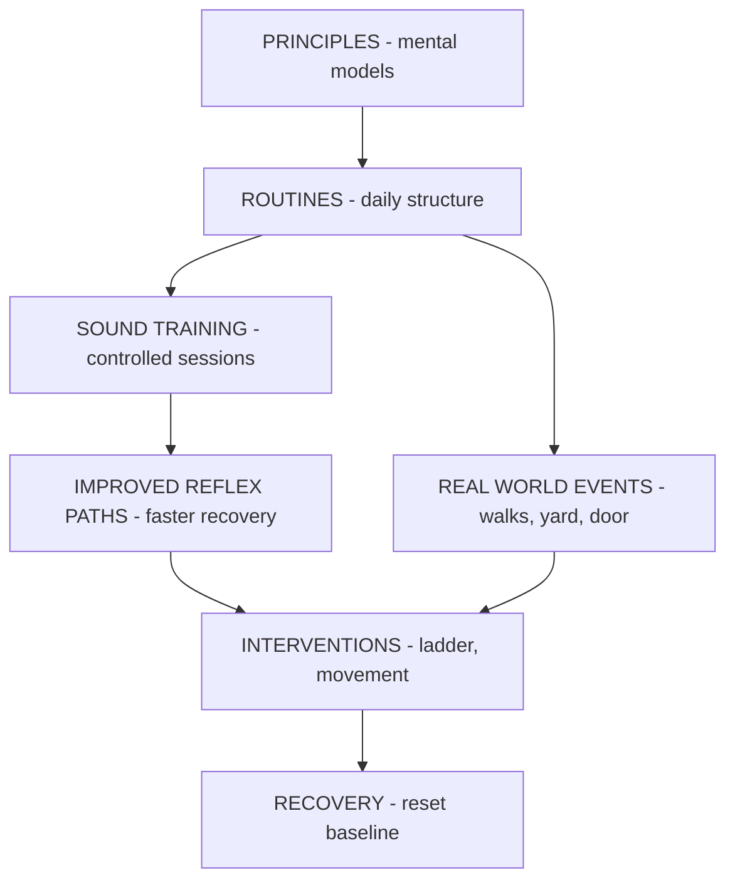

```mermaid
flowchart TD
  P[PRINCIPLES - mental models]
  R[ROUTINES - daily structure]

  ST[SOUND TRAINING - controlled sessions]
  RW[REAL WORLD EVENTS - walks, yard, door]

  IR[IMPROVED REFLEX PATHS - faster recovery]
  INT[INTERVENTIONS - ladder, movement]
  REC[RECOVERY - reset baseline]

  P --> R
  R --> ST
  ST --> IR
  R --> RW
  IR --> INT
  RW --> INT
  INT --> REC
```
